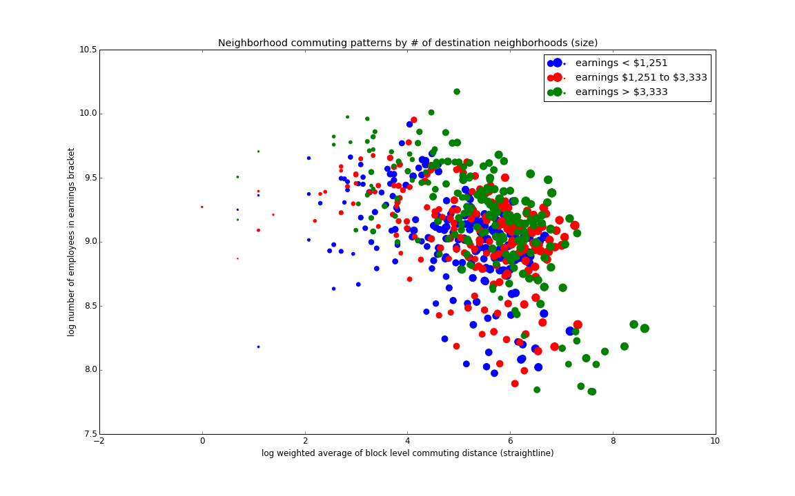

### Homework 8 - visualization phase 1
ipython notebook [here](./HW8_crh278_phase1.ipynb) will

1. download and block to block commuting flows for specified year and job type from [LODES](http://lehd.ces.census.gov/data/lodes/LODES7/ny/od/) for New York
2. extract just blocks in NYC
3. calculate distances for origin-destination pairs, 
4. summarize distances by neighborhood, and
5. create and save an image to the local working directory

NOTE: uses geopandas for distance calculation

Example image:

### HW8 - phase 2: plot reviews

1. [edl268 plot review](./edl268_plot_review.md)
2. [ds2455 plot review](./ds2455_plot_review.md)
3. [jh5138 plot review](./jh5138_plot_review.md)
